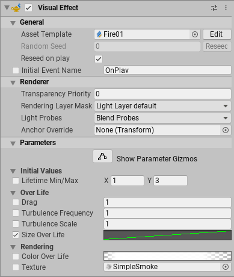

# Visual Effect (Component)

The Visual Effect Component creates an instance of a Visual Effect in the scene, based on a Visual Effect Graph Asset. It controls how the effect plays, renders and let the user customize the instance by editing [Exposed Properties](PropertiesAndBlackboard.md#Exposed Properties)

## How to create a Visual Effect

In order to create a Visual Effect, you can manually add the component via the Add Component Menu in the inspector or in the menu : Component / Effects / Visual Effect. 

You can also create a complete Game Object holding a Visual Effect Component by using the GameObject menu under the Category Visual Effects and Selecting Visual Effect.

Finally, When you drag a Visual Effect Graph asset from the project view to the scene view or hierarchy view. It will create automatically a Visual Effect Component on the Game Object you dropped the asset onto, or create a new game object with a Visual Effect Component if you drop it in an empty space.

## The Visual Effect Inspector

The Visual Effect Inspector helps you configure every instance of a Visual Effect. It displays values only relevant to this particular instance.

| Item               | Description                                                  |
| ------------------ | ------------------------------------------------------------ |
| Asset Template     | Object Field that references the Visual Effect Graph being used for this Instance. (Edit Button Opens the Graph and Connects this instance to the Target Game Object panel) |
| Random Seed        | Integer Field that displays the current random seed used for this instance. (Reseed button enables computing a new random seed for this component) |
| Reseed On Play     | Boolean setting that computes a new seed at random every time the Play Event is sent to the Visual Effect |
| Initial Event Name | Enables overriding the Default Event name (string) sent to the component when it becomes enabled. (Default : *OnPlay* ) |

#### Rendering Properties

Rendering properties controls how the visual effect instance will render and receive lighting. These properties are stored per-instance in the scene and do not apply modifications to the Visual Effect Graph.

| Item                  | Description                                                  |
| --------------------- | ------------------------------------------------------------ |
| Transparency Priority | **High Definition SRP Only**: Controls the Transparency ordering of the effect. |
| Lighting Layer Mask   | **High Definition SRP Only**: Controls the Lighting Layer Mask, if it is configured in the High Definition SRP Asset. |
| Light Probes          | Controls the Use of Light probes to compute the Ambient Lighting of the Effect. |
| Anchor Override       | (Visible Only using Blend Probes option for Light Probes) : Defines an alternative transform to compute the position of the probe sampling. |
| Proxy Volume Override | (Visible Only using Proxy Volume option for Light Probes) : Defines an alternative Light Probe Proxy volume in order to compute the probe sampling. |

#### Properties

The properties category display any Property that have been defined in the Visual Effect Graph blackboard as Exposed Property. Every property can be overridden from its default value in order to customize the Visual Effect instance in the scene. Some properties can also be edited using Gizmos directly in the scene.

| Item                 | Description                                                  |
| -------------------- | ------------------------------------------------------------ |
| Show Property Gizmos | Toggles the display of the editing gizmos used to set up some exposed properties (Spheres, Boxes, Cylinders, Transforms, Positions). Each gizmo can then be accessed using its dedicated button next to its property. |
| Properties           | All properties that have been exposed in the Visual Effect Graph Asset.  You can edit these properties for this instance of the Visual Effect. For more information see [Exposed Properties](PropertiesAndBlackboard.md#Exposed Properties) |

In order to access property values you can edit them using the inspector, use the [C# API](https://docs.unity3d.com/2019.3/Documentation/ScriptReference/VFX.VisualEffect.html) or use Property Binders.
